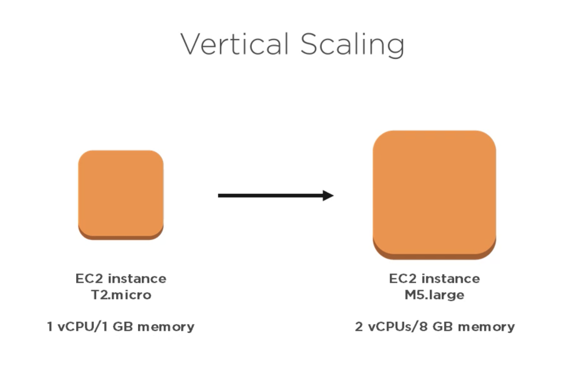
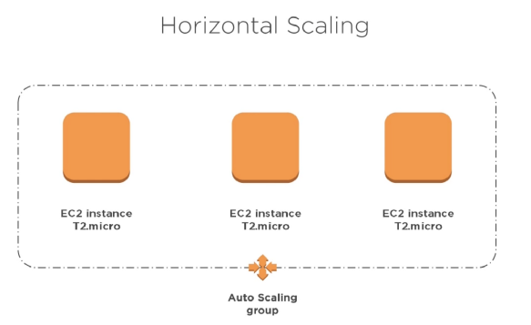

# SRE Monitoring Documentation

## AWS Cloud Watch 

Monitoring service for AWS resources and services 
- Scalable
- Highly available 
Track metrics, collect log files and automatically react to changes in AWS resources you can trigger a notification once CPU usage goes above a set amount

## Autoscaling
Auto adjusts the amount of computational resources based on the server load is a configuration set to manage the size of the instance, once the traffic has reduced the autoscaling then terminates the created additional instances.

### Scale-up (Vertical)
Scaling up is when you change the instance types within your Auto Scaling Group to a higher type (for example: changing an instance from a t.micro to a t.medium.
Vertical-scaling is often limited to the capacity of a single machine, scaling beyond that capacity often involves downtime and comes with an upper limit.

### Scale-out (Horizontal)
Horizontal scaling (aka scaling out) refers to adding additional nodes or machines to your infrastructure to cope with new demands. If you are hosting an application on a server and find that it no longer has the capacity or capabilities to handle traffic, adding a server may be your solution
when you add more instances to your Auto Scaling Group it is often easier to scale dynamically by adding more machines into the existing pool.

## Loadbalancing
Load balancers are used to increase capacity (concurrent users) and reliability of applications. They improve the overall performance of applications by decreasing the burden on servers associated with managing and maintaining application and network sessions, as well as by performing application-specific tasks
In our case we use the load balancer to distribute traffic across multiple EC2 instances which will be spun up if the CPU usage is about 50%.

### Application Load Balancer
The Application Load Balancer operates at the request level only. If you're dealing with HTTP requests, which you are for your web application, you can use this. It supports the basic feature of distributing requests using the round robin algorithm. It also supports advanced features like host and path based routing.

### Network Load Balancer
Network Load Balancing (NLB) feature distributes traffic across several servers by using the TCP/IP networking protocol. By combining two or more computers that are running applications into a single virtual cluster, NLB provides reliability and performance for web servers and other mission-critical servers
servers in an NLB cluster are called hosts, and each host runs a separate copy of the server applications. NLB distributes incoming client requests across the hosts in the cluster. You can configure the load that is to be handled by each host. You can also add hosts dynamically to the cluster to handle increased load. NLB can also direct all traffic to a designated single host, which is called the default host

### Classic Load Balancer
The Classic Load Balancer operates on both the request and connection levels. However, it doesn't support features like host and path based routing. This is the first load balancer that AWS introduced in 2009 so it is missing some features. The Application Load Balancer was introduced to address this. A Classic Load Balancer is recommended only for EC2 Classic instances.

## Creating an Auto Scaling Group
### First a Launch Template is needed
- Navigate to `Auto Scaling Groups` on the left hand navigation menu
- Click ` Create an Auto Scaling group`
- Select `Create a launch template`
- Launch template name: `SRE_kieron_AUTOS`
- Click `Add Tag` Key: `Name` Value: `SRE_kieron_AUTOS`
- Amazon machine image (AMI): `SRE_kieron_app_ami`
- Auto Scaling group name: `SRE_kieron_AUTOS`
- Instance type: `t1.micro`
- Key pair (login): `sre_key`
- Network settings
    - Networking platform: `Virtual Private Cloud (VPC)`
    - Security groups: `sre_kieron_app`
- Click `Create launch template`

### Now for the Auto Scaling group from template
- Click `Create Auto Scaling group`
- Auto Scaling group name: `SRE_kieron_scaling`
- Launch template: `SRE_kieron_AUTOS`
- Click `Next`
- Network
    - VPC `default`
    - Subnets: `eu-west-1a | subnet`
 - Load balancing - optional: `Attatch to a new load balancer` unless you have one currently set up
 - Load balancer name `SRE-kieron-scaling-1`
 - Availability Zones and subnets: Select `eu-west-1b` as there is at least 2 subnets needed
 - Default routing (forward to): `Create a target group` unless you have already configured this
 - Click `Next`
 - Configure group size and scaling policies
    - Group size
    - Desired capacity: `1`
    - Minimum capacity: `1`
    - Maximum capacity: `3`
 - Scaling policies
    - Target tracking scaling policy
    - Scaling policy name: ` SRE_kieron_tt`
    - Metric type: `Average CPU utilization`
    - Target value: `50`
    - Click `Next`
 - Add notifications
    - Click `Add notification`
    - Come back to this)
 - click `Create Auto Scaling group`
## Attaching to AWS CloudWatch

