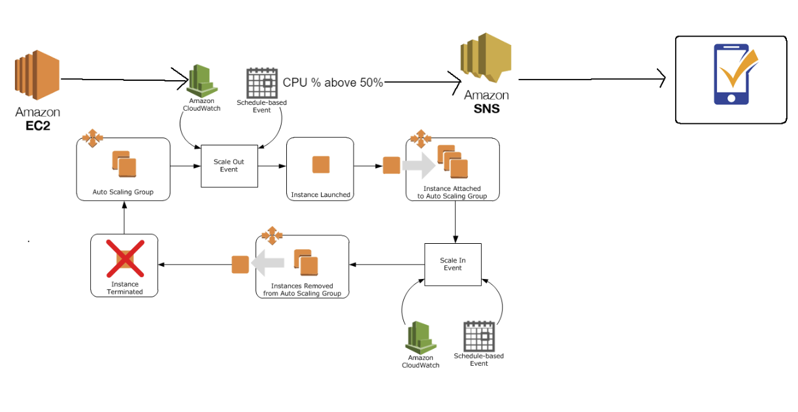
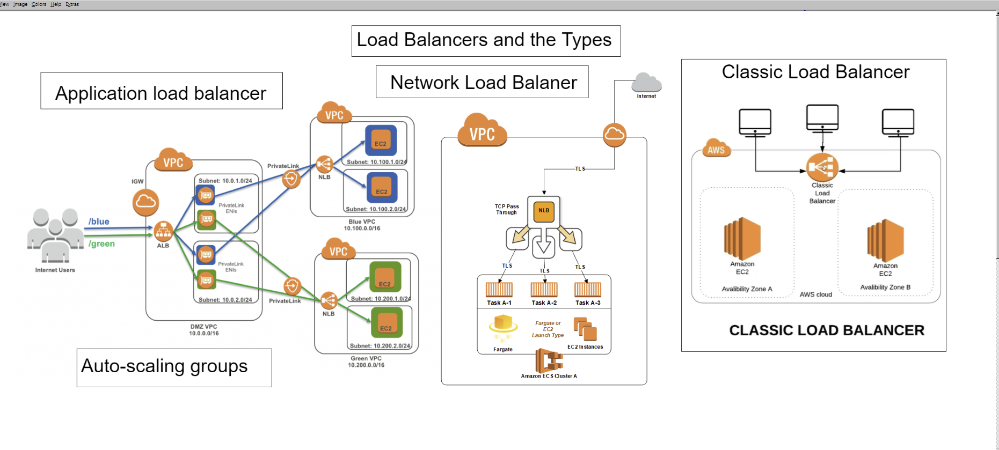

# SRE Monitoring Documentation

## AWS Cloud Watch 

Monitoring service for AWS resources and services 
- Scalable
- Highly available 
Track metrics, collect log files and automatically react to changes in AWS resources you can trigger a notification once CPU usage goes above a set amount

## Autoscaling
Auto adjusts the amount of computational resources based on the server load is a configuration set to manage the size of the instance, once the traffic has reduced the autoscaling then terminates the created additional instances.

### Scale-up
Scaling up is when you change the instance types within your Auto Scaling Group to a higher type (for example: changing an instance from a t.micro to a t.medium.
Vertical-scaling is often limited to the capacity of a single machine, scaling beyond that capacity often involves downtime and comes with an upper limit.

### Scale-out (Horizontal)
 when you add more instances to your Auto Scaling Group it is often easier to scale dynamically by adding more machines into the existing pool. 

## Loadbalancing
Used to distribute traffic between EC2 instances so no individual instance gets overwhelmed
which could lead to crashes and failures.

### Application Load Balancer
If you are running only one 
### Network Load Balancer
Multiple VPC
### Classic Load Balancer

## Creating an Auto Scaling Group
### First a Launch Template is needed
- Navigate to `Auto Scaling Groups` on the left hand navigation menu
- Click ` Create an Auto Scaling group`
- Select `Create a launch template`
- Launch template name: `SRE_kieron_AUTOS`
- Click `Add Tag` Key: `Name` Value: `SRE_kieron_AUTOS`
- Amazon machine image (AMI): `SRE_kieron_app_ami`
- Auto Scaling group name: `SRE_kieron_AUTOS`
- Instance type: `t1.micro`
- Key pair (login): `sre_key`
- Network settings
    - Networking platform: `Virtual Private Cloud (VPC)`
    - Security groups: `sre_kieron_app`
- Click `Create launch template`

### Now for the Auto Scaling group from template
- Click `Create Auto Scaling group`
- Auto Scaling group name: `SRE_kieron_scaling`
- Launch template: `SRE_kieron_AUTOS`
- Click `Next`
- Network
    - VPC `default`
    - Subnets: `eu-west-1a | subnet`
 - Load balancing - optional: `Attatch to a new load balancer` unless you have one currently set up
 - Load balancer name `SRE-kieron-scaling-1`
 - Availability Zones and subnets: Select `eu-west-1b` as there is at least 2 subnets needed
 - Default routing (forward to): `Create a target group` unless you have already configured this
 - Click `Next`
 - Configure group size and scaling policies
    - Group size
    - Desired capacity: `1`
    - Minimum capacity: `1`
    - Maximum capacity: `3`
 - Scaling policies
    - Target tracking scaling policy
    - Scaling policy name: ` SRE_kieron_tt`
    - Metric type: `Average CPU utilization`
    - Target value: `50`
    - Click `Next`
 - Add notifications
    - Click `Add notification`
    - Come back to this)
 - click `Create Auto Scaling group`
## Attaching to AWS CloudWatch

